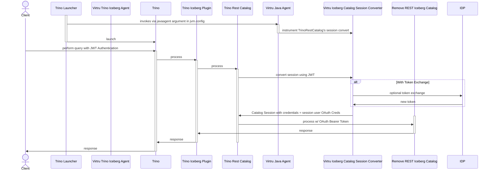

# Trino Iceberg Plugin + JWTAware Header Authentication

A Java Agent that injects JWTAware credentials for use in
Iceberg Rest Catalog authorization within the standard Trino Iceberg Plugin

Prerequisites:
- [Trino header authentication is enabled and configured to use the JWT Header Authenticator](./index.md#header-authentication-configuration)

## Configuration
This agent should be enabled via Trino's jvm.config

Example addition to `jvm.config`:
```
-javaagent:/usr/lib/trino/agent/iceberg-agent.jar
```

The standard Trino Iceberg Connector and associated FileSystem are implemented in a way that
makes it hard to extend using standard Java extension or using overriding via Dependency injection

Therefore, the approach taken uses ByteBuddy's ByteCode library to instrument these modules
to inject TDF extension points and introduces the following components and ByteBuddy based changes:
1. Iceberg Extension Configuration : Configuration of Iceberg Catalog TDF values
2. Iceberg TDF Service: Component injected and used to interact with TDF related services and utilities
3. S3FileSystemModule Delegate to bind the Iceberg TDF Service, Connector Config (TDF) and Iceberg Extension Configuration into the Trino Guice framework 
4. Iceberg Catalog Delegates to perform an STS Web Identity Token Exchange between the Secure Object Proxy and Trino; populate the temporary S3 Credentials for use by the connector for operations against the object store
5. Iceberg Catalog Session Delegate to use the user's JWT as authentication in the standard token exchange between Trino and Catalog instead of the default Token Exchange with a self-minted JWT
6. Delegates to push down Connection Session and Identity to the File System performing operations against the object store. 
7. Delegates to augment S3 Put Operations to populate TDF Data Policy on User Metadata

### Sequence Diagram: Client to Remote Iceberg Rest Catalog with OAuth Token Authorization

