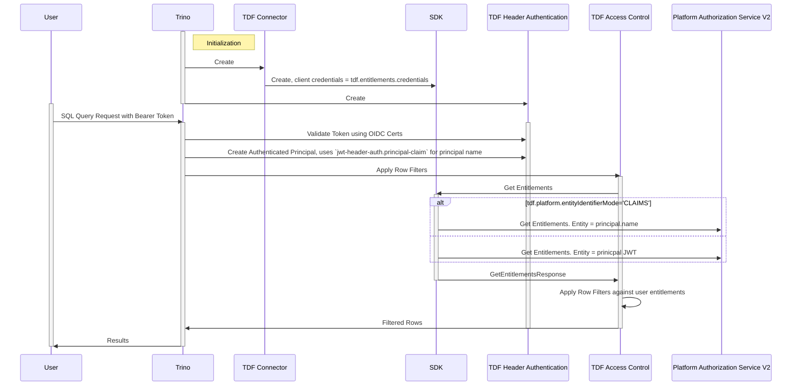

# TDF Trino Plugin

## Overview

The [TDF Plugin](../src/main/java/tdf/trino/TDFPlugin.java) extends [Trino](https://trino.io/) with Trusted Data Format (TDF) capabilities to provide transparent Attribute-Based Access Control (ABAC) features for a data source. The plugin is built using Trino's [Plugin framework](https://trino.io/docs/current/installation/plugins.html) and implements the [Service Provider Interface (SPI)](https://trino.io/docs/current/develop/spi-overview.html).

### Key Features

- **Data Protection**: Transparently encrypts and decrypts data using TDF
- **Fine-grained Access Control**: Implements attribute-based access control for SQL queries
- **Auditing**: Provides comprehensive logging and event tracking
- **Authentication**: Supports header-based authentication for secure access

### Approach
TDF Trino enforces row level security. TDFs on a row can have different policy to dictate row visibility trimming logic. If a user's entitlements include at least one of the row's attributes, then the row will be returned to them with `_tdf_` columns appropriately processed based on ABAC authorization decisions.

At table creation, TDF Trino adds an extra column for the row's policy and uses this to filter out rows that the user should not see based on their entitlements. Decryption of the TDF handles actual policy enforcement.

Using the row's policy, TDF Trino accepts NanoTDFs or transparently encrypts plaintext on insert for any columns designated during table creation as `_tdf_<column_name>`. TDF Trino uses the `_tdf_` prefix internally to track TDF columns. Users should query and expect results with just the `<column_name>`.

### Supported Connectors

The TDF plugin currently wraps and extends the following Trino connectors:

- PostgreSQL connector (`tdf_postgresql`)
- Memory connector (`tdf_mem`)
- Secure Vector connector (`tdf_securevector`)

## Setup and Configuration

### Plugin Installation

1. Place the TDF Trino plugin JAR in the Trino plugin directory
2. Configure the connector properties as described below
3. Restart Trino to load the plugin

### Connector Configuration

Configuration files should be placed in `etc/catalog/<name>.properties`

> **Tip**: It is recommended to use Trino environment variable syntax for sensitive values: `${ENV:VARIABLE_NAME}`

#### Common TDF Connector Properties

Properties shared among TDF Connectors:

| Property name                     | Description                                                                                                                                        |
|-----------------------------------|----------------------------------------------------------------------------------------------------------------------------------------------------|
| tdf.entitlements.credentials      | Client ID and secret (format: `id:secret`) for platform entitlement calls                                                                          |
| tdf.platform.endpoint             | URL of the TDF platform service endpoint                                                                                                           |
| tdf.platform.entityIdentifierMode | Set the Entity Type used for requesting Entitlements from the authorization.v2.AuthorizationService.  Default = CLAIMS, options = CLAIMS, USERNAME |
| tdf.platform.protocol             | The protocol used to communicate with the platformm, default = GRPC. options = GRPC, GRPC_WEB, CONNECT                                             |
| tdf.platform.insecure             | Set to `true` to allow insecure (HTTP) connections to the platform, default `false`                                                                |
| tdf.trusted-certs-directory       | Directory containing trusted certificates for secure platform connections                                                                          |
| tdf.rewrap.credentials            | Client ID and secret (format: `id:secret`) for platform rewrap calls                                                                               |
| tdf.tagging-pdp.endpoint          | URL of the Tagging Policy Decision Point service                                                                                                   |
| tdf.use-write-policy              | Set to `true` to write TDF data policy into columns transparently, default `false`                                                                 |
| tdf.policy-column                 | The name of the column used to store TDF policy, set to `tdf_policy` by default                                                                    |
| tdf.action.view                   | The name of the action to use for `_tdf_` column read decisions, set to `read` by default                                                          |
| tdf.action.decrypt                | The name of the action to use for `_tdf_` column decrypt decisions, set to `decrypt` by default                                                    |

#### TDF PostgreSQL Connector

The `connector.name` value must be set to `tdf_postgresql`

[Uses TDF Common Connector Properties](#common-tdf-connector-properties); plus:

| Property name                     | Description                                                                                                                                        |
|-----------------------------------|----------------------------------------------------------------------------------------------------------------------------------------------------| 
| connector.name                    | Name of the connector, required to be `tdf_postgresql`                                                                                             |
| connection-url                    | JDBC connection URL for the PostgreSQL database                                                                                                    |
| connection-user                   | Username for the PostgreSQL database connection                                                                                                    |
| connection-password               | Password for the PostgreSQL database connection                                                                                                    | 

#### TDF Memory Connector

The `connector.name` value must be set to `tdf_mem`

[Uses TDF Common Connector Properties](#common-tdf-connector-properties); plus:

| Property name                     | Description                                                                                                                                        |
|-----------------------------------|----------------------------------------------------------------------------------------------------------------------------------------------------| 
| connector.name                    | Name of the connector, required to be `tdf_mem`                                                                                                    |
| memory.max-data-per-node          | Maximum amount of data to store in each node's memory                                                                                              |  

#### TDF Secure Vector Connector
The `connector.name` value must be set to `tdf_securevector`

[Uses TDF Common Connector Properties](#common-tdf-connector-properties) plus additional configuration parameters. See [Secure Vector Trino Plugin documentation](./secure-vector-trino.md) for details.

#### Iceberg with TDF Extension Connector

Extends the [Standard Trino Iceberg Connector](https://trino.io/docs/current/connector/iceberg.html) to honor Connector Session and Data Policy and integration with Secure
Data Catalog and Secure Object Proxy. [Iceberg Extension Design](./iceberg.md)

The `connector.name` value must be set to `iceberg`

[Uses TDF Common Connector Properties](#common-tdf-connector-properties); plus:

| Property name              | Description                                                      |
|----------------------------|------------------------------------------------------------------| 
| tdf.iceberg.protectionMode | Protection Mode; SECURE_OBJECT_PROXY (default); TRINO            |
| tdf.iceberg.sts.role       | Iceberg S3 STS Assume Role with Web Identity Token Role Value    |  
| tdf.iceberg.sts.region     | Iceberg S3 STS Assume Role with Web Identity Token Region        |
| tdf.iceberg.sts.endpoint   | Iceberg S3 STS Assume Role with Web Identity Token Role Endpoint |

### Header Authentication Configuration

The header authenticator properties should be configured in `etc/header-authenticator.properties`

| Property name                   | Description                                                              |
|---------------------------------|--------------------------------------------------------------------------|
| header-authenticator.name       | Name of the header used for authentication ; should be `jwt-header-auth` |
| jwt-header-auth.oidc-jwks-url   | OIDC Token Endpoint URL for certificate validation                       |
| jwt-header-auth.principal-claim | The OIDC claim used to identity the user; default = 'sub' (subject)      |


## Diagrams


### Sequence Diagram: User Query




## Usage Examples

### Create a Table with TDF Protection

You can create tables with columns protected with TDF:

```sql
CREATE TABLE protected_data (
  id BIGINT,
  _tdf_name VARBINARY,
  _tdf_ssn VARBINARY
);
```

#### TDF Columns
`_tdf_` column type must be `varbinary` at table creation.

Plaintext data will be transparently encrypted on insert using the attributes specified in the `<catalog>.tdf_data_attributes` session property.

Policy column added transparently at table creation and populated transparently on insert.

Clients can also send NanoTDFs for `_tdf_` columns - data attributes will be extracted from the header and added to the policy column. NanoTDFs sent MUST have been encrypted using `NanoTDFType.PolicyType.EMBEDDED_POLICY_PLAIN_TEXT`

Clients can send NanoTDFs or plaintext for `_tdf_` columns - the plaintext for each cell will still be transparently encrypted using the `<catalog>.tdf_data_attributes` session property.

Column names used and retrieved without the `_tdf_` prefix. Dynamic comments remind clients which columns are TDF-protected.

```sql
SHOW COLUMNS FROM protected_data;

Column     | Type           | Comment
-----------------------------------------
id         | bigint         |
name       | varbinary      | TDF column
ssn        | varbinary      | TDF column
tdf_policy | array(varchar) |
```

### Insert Data
Set row policy using session property before insert.
```sql
SET SESSION <catalog>.tdf_data_attributes='https://example.com/attr/attr1/value/value1';
```

TDF Trino transparently encrypts `_tdf_` columns on insert and populates the policy column using those attributes.
```sql
INSERT INTO protected_data (id, name, ssn) VALUES (123, 'bob', '111-22-333');
```

### Query Protected Data

TDF Trino consults platform for authorization decisions then sends back `_tdf_` cells in one of 3 ways -
* decrypted, if the user has `tdf.action.view` and `tdf.action.decrypt`
* encrypted pass through, if the user has `tdf.action.view`
* the literal string REDACTED, if any other case

```sql
SELECT * FROM protected_data WHERE id = 123

id   | name | ssn         | tdf_policy
123  | bob  | 111-22-3333 | [https://example.com/attr/attr1/value/value1]
```

## Troubleshooting

### Common Issues

- **Authentication Failures**: Verify that the client credentials are correct and have appropriate permissions
- **Certificate Errors**: Ensure the certificate directory path is correct and contains valid certificates
- **Performance Issues**: Consider adjusting memory settings for optimal performance

### Logging

To enable debug logging, add the following to `etc/log.properties`:

```properties
tdf.trino=DEBUG
```

# Helm Chart Deployment

Deploy the TDF-TRINO proxy via a Helm Chart deployment.  The chart uses the [Trino Helm chart](https://github.com/trinodb/charts/blob/main/charts/trino/README.md).
The Trino Chart Documentation should be consulted for detailed Trino Configuration.

## Config Map
Additional configuration is injected in to the environment via a config map

This example configuration sets:
* the Data Security Platform's endpoint; e.g. a sample:
  ```shell
  data_security_platform_endpoint=https://dsp.example.com
  ```
* sets an empty value for trusted certs
* sets an empty value for tag endpoint
* sets the IDP, OIDC Certificate (JWKS) URL; e.g. for keycloak
  ```shell
  idp_cert_url=https://keycloak.example.com/auth/realms/opentdf/protocol/openid-connect/certs
  ```

```shell
kubectl create configmap tdf-trino \
--from-literal=TDF_PLATFORM_ENDPOINT="$data_security_platform_endpoint" \
--from-literal=TDF_PLATFORM_TRUSTED_CERTS="" \
--from-literal=TDF_TAG_ENDPOINT="" \
--from-literal=TDF_IDP_CERT_URL="$idp_cert_url"
```

## Secrets
Create a secret to store values for the tdf-trino deployment.

Set values (all values are examples)
```shell
TDF_ENTITLEMENT_CLIENT_ID=opentdf
TDF_ENTITLEMENT_CLIENT_SECRET=replaceme
TDF_REWRAP_CLIENT_ID=opentdf-sdk
TDF_REWRAP_CLIENT_SECRET=replaceme
TDF_POSTGRES_CONNECTION_URL=jdbc:postgresql://trino-postgres:5432/postgres
TDF_POSTGRES_USER=postgres
TDF_POSTGRES_PASSWORD=password
TRINO_INTERNAL_COMMUNICATION_SHARED_SECRET=mysharedtrinosecret
```

Create the secret. `tdf-trino` is used to match the default chart value.
```shell
kubectl create secret generic tdf-trino \
  --from-literal=TDF_ENTITLEMENT_CLIENT_ID=$TDF_ENTITLEMENT_CLIENT_ID \
  --from-literal=TDF_ENTITLEMENT_CLIENT_SECRET=$TDF_ENTITLEMENT_CLIENT_SECRET \
  --from-literal=TDF_REWRAP_CLIENT_ID=$TDF_REWRAP_CLIENT_ID \
  --from-literal=TDF_REWRAP_CLIENT_SECRET=$TDF_REWRAP_CLIENT_SECRET \
  --from-literal=TDF_POSTGRES_CONNECTION_URL=$TDF_POSTGRES_CONNECTION_URL \
  --from-literal=TDF_POSTGRES_USER=$TDF_POSTGRES_USER \
  --from-literal=TDF_POSTGRES_PASSWORD=$TDF_POSTGRES_PASSWORD \
  --from-literal=TRINO_INTERNAL_COMMUNICATION_SHARED_SECRET=$TRINO_INTERNAL_COMMUNICATION_SHARED_SECRET
```

## Install the chart

Set some variables for image repository and image tag (values are example only)

```shell
image_repository=ghcr.io/virtru-corp/dcr-extensions/tdf-trino
image_tag=local
bundle_dir=./virtru-tdf-trino-bundle_0.0.5
chart_path=$bundle_dir/charts/tdf-trino-0.1.0.tgz
chart_values_file=$bundle_dir/configs/tdf_trino_example_session_based_policy_values.yaml
```


```shell
helm upgrade --install tdf-trino $chart_path \
  -f $chart_values_file \
  --set trino.image.repository=$image_repository \
  --set trino.image.tag=$image_tag 
```


## Clean up

```shell
helm delete tdf-trino
kubectl delete secret tdf-trino
kubectl delete cm tdf-trino
```


## Additional Resources

- [Trino Documentation](https://trino.io/docs/current/)
- [TDF Specification](https://github.com/opentdf/spec/)
- [Attribute-Based Access Control (ABAC)](https://en.wikipedia.org/wiki/Attribute-based_access_control)


